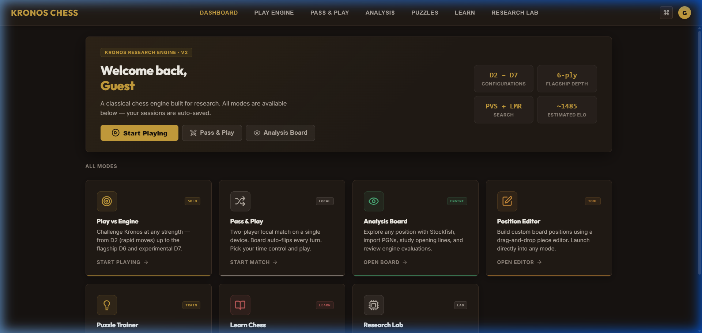
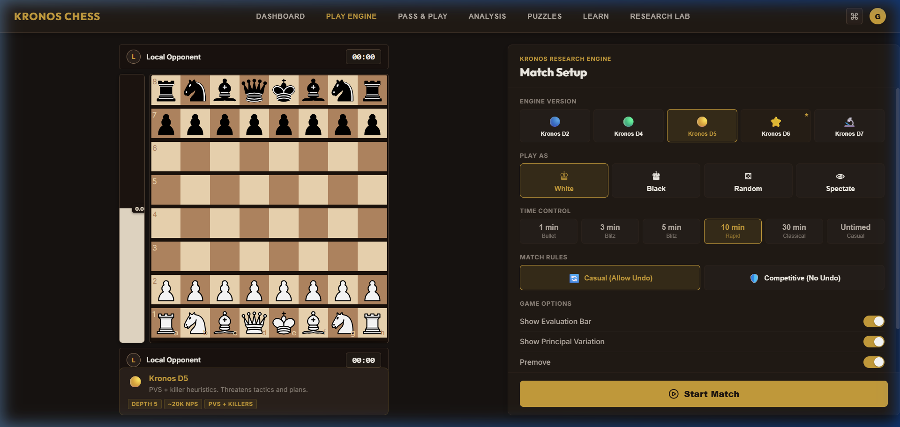
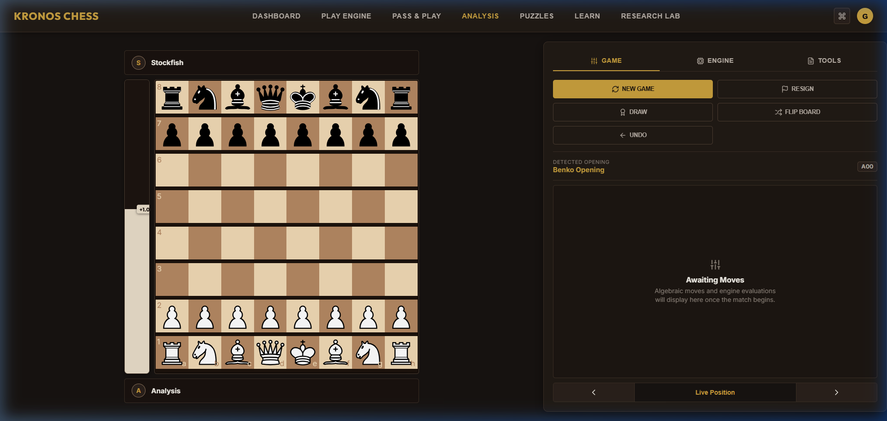
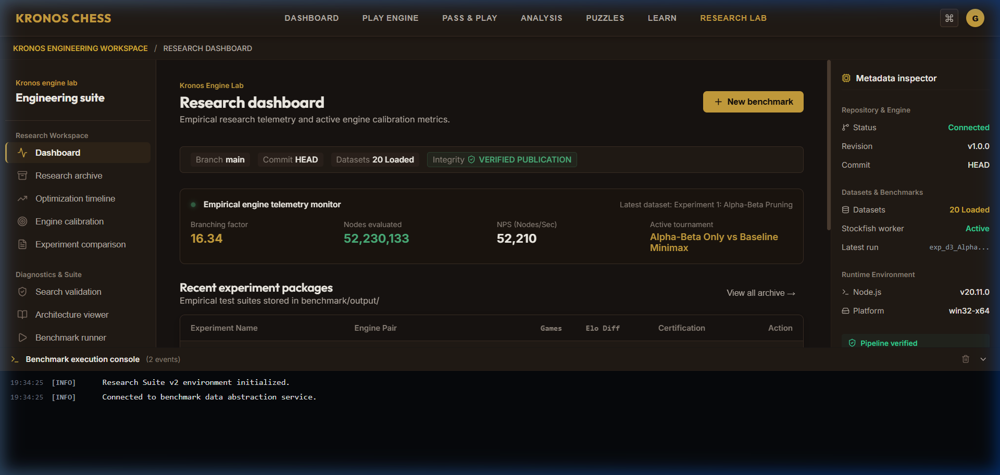
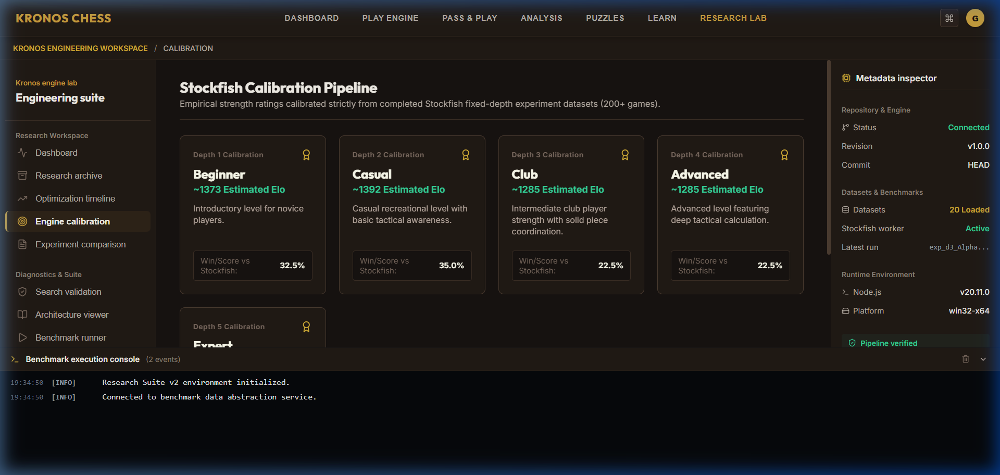
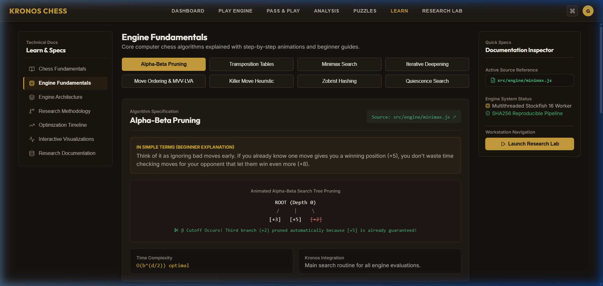
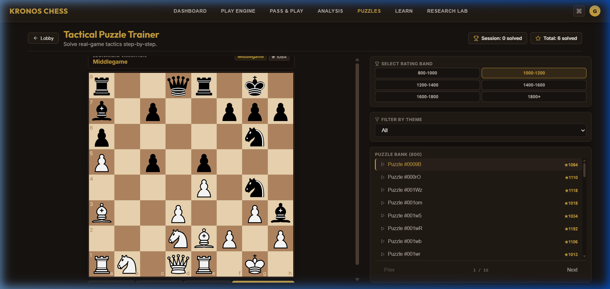

# Kronos Chess & Empirical Research Laboratory

[](#)
[](#)
[](#)
[](#)
[](#)
[](#)
[](#)
[](#)

Kronos is a modular, high-fidelity JavaScript chess engine and empirical benchmarking framework designed to evaluate classical alpha-beta search behaviors, heuristics, and memory dynamics inside managed, garbage-collected runtimes.

---

## What is Kronos?

Kronos is a modern chess engine and benchmarking platform built to investigate how low-latency search algorithms behave inside dynamic, garbage-collected environments like V8. Historically, game-tree search modules have been written in systems languages like C++ or Rust to avoid runtime overhead. Kronos serves as a testbed for performance engineering techniques (such as object pooling, bitwise state replication, and transposition table structures) required to achieve GC-neutral searches in standard web contexts.

The system is composed of an interactive React UI client, a background search engine isolated in multi-threaded Web Workers, and a headless Node.js benchmarking framework. The desktop workstation features a complete player interface, game analysis tools, and a Research Lab dashboard for executing engine tournaments, analyzing depth scaling, and calibrating performance relative to Stockfish reference models.

Additionally, Kronos includes an educational Learn Portal containing interactive algorithm simulations and progressive curricula detailing chess programming theory. The codebase is designed for researchers, systems engineers, and students looking for a fully documented, open-source chess engine workstation.

---

## Features

### 🧠 Chess Engine
* **Search Core**: Negamax implementation with Alpha-Beta pruning, Principal Variation Search (PVS), and Iterative Deepening.
* **Pruning & Reductions**: Late Move Reductions (LMR), Null Move Pruning (NMP), and Quiescence Search extensions to combat the horizon effect.
* **Heuristics & Tables**: MVV-LVA move ordering, history heuristic weights, killer move slots, and a size-bounded Transposition Table (TT) indexed using 64-bit Zobrist key hashing.

### 🔬 Research Framework
* **Orchestrator**: Automated research pipeline manager for overnight multi-family experiment execution.
* **SPRT Validation**: Head-to-head tournaments using Sequential Probability Ratio Testing (SPRT) to accept or reject engine optimization hypotheses.
* **Calibration**: External calibration mapping Kronos playing strength to depth-limited Stockfish reference profiles.
* **Telemetry**: Node throughput count, NPS (Nodes Per Second), branching factor analytics, and automatic SVG chart rendering.

### 💻 User Workstation Interface
* **Play & Practice**: Play against various engine difficulties (Kronos D2 through D7) with selectable time controls.
* **Research Lab**: Run matches, calibrate ratings, compare live experiment stats side-by-side, and inspect dataset manifests.
* **Puzzle Trainer**: Solve tactical position puzzles sourced from real games with step-by-step move validation.
* **Learn Portal**: Study progressive roadmaps from basic chess coordinates to advanced minimax search structures.

---

## Architecture

The system utilizes an isolated worker architecture to separate heavy search calculations from interface rendering thread pools:

```
┌─────────────────────────────────────────────────────────────┐
│                       REACT VIEW LAYER                      │
│   • Renders chessboard, evaluation bar, opening explorer    │
│   • Receives user events, dispatches moves to hook          │
└──────────────┬──────────────────────────────▲───────────────┘
               │                              │
               │ PostMessage (Move / FEN)     │ Telemetry (Nodes / PV / Depth)
               ▼                              │
┌─────────────────────────────────────────────┴───────────────┐
│                    WEB WORKER SEARCH ENGINE                 │
│   • Offloads minimax calculations from main execution loop  │
│   • Manages search time boundaries & depth iterations       │
├─────────────────────────────────────────────────────────────┤
│   ┌─────────────────────────────────────────────────────┐   │
│   │                 MINIMAX SEARCH CORE                 │   │
│   │   • Evaluates move trees via Negamax formulation    │   │
│   │   • Prioritizes captures using MVV-LVA move order   │   │
│   └──────────┬──────────────────────────────▲───────────┘   │
│              │ Zobrist Key Hash             │ Cache Hit / Node Eval
│              ▼                              │
│   ┌─────────────────────────────────────────┴───────────┐   │
│   │             TRANSPOSITION TABLE CACHE               │   │
│   │   • Holds 64-bit indexed evaluated board states      │   │
│   │   • Provides O(1) lookups to prune duplicate paths  │   │
│   └─────────────────────────────────────────────────────┘   │
└─────────────────────────────────────────────────────────────┘
```

---

## Repository Structure

* [**src/**](file:///c:/Users/Piyush/OneDrive/Desktop/chess/src) — Contains the React client views, state hooks, theme configurations, and background engine workers.
* [**benchmark/**](file:///c:/Users/Piyush/OneDrive/Desktop/chess/benchmark) — Headless Node.js benchmarking framework, automated pipeline managers, tournaments, and openings.
* [**research-paper/**](file:///c:/Users/Piyush/OneDrive/Desktop/chess/research-paper) — Source LaTeX files and section drafts for the Kronos systems engineering research paper.
* [**scripts/**](file:///c:/Users/Piyush/OneDrive/Desktop/chess/scripts) — Utility scripts for compilation, dataset verification, and repository cleanup.
* [**public/**](file:///c:/Users/Piyush/OneDrive/Desktop/chess/public) — Static web assets, favicon resources, and database puzzle sets.

---

## Technology Stack

* **Frontend Framework**: React 19, Lucide React (Icons), Vanilla CSS
* **Build System & Tooling**: Vite 8, Rolldown (Minification), Oxlint (Linting)
* **Chess System Engine**: Chess.js (Move generation & validation), React-Chessboard (Render)
* **Web Threads Concurrency**: HTML5 Web Workers (Background search isolation)
* **Benchmark Engine**: Node.js (Headless runner), Stockfish.js (Calibration reference models)
* **Visual Data Graphs**: D3-style SVG rendering scripts

---

## Research Contributions

Kronos concentrates on systems engineering methods applied to dynamic runtimes:
* **Garbage-Collector Neutrality**: Demonstrates how in-place board mutations, pre-allocated transposition caches, and avoiding object instantiations inside the recursive search path can eliminate garbage collector latency stutters.
* **Reproducible Testbeds**: Every benchmark logs hardware specs, configuration checksums, and random seeds to guarantee reproducibility of experimental tournament datasets.
* **Ablation Isolation Framework**: Isolates algorithm contributions by executing tournaments against sibling configurations with individual search features disabled.

---

## Experimental Highlights

* **Heap Stabilization**: Transitioning to size-bounded transposition tables bounded heap usage to a flat memory layout, preventing V8 GC sweeps during deep search.
* **SPRT Quiescence Search Validation**: Under SPRT testing, Quiescence Search demonstrated statistically significant playing strength gains (LLR > 18.8), validating its effectiveness at fighting the horizon effect.
* **Pruning Ablation**: Ablation runs verified that Late Move Reductions (LMR) contributes the highest search space reduction (compressing nodes by up to 80% with minimal tactical degradation).

---

## Screenshots

<div align="center">
  <h3>Workstation Dashboard</h3>
  
  <br /><br />
  <h3>Play vs Engine Setup</h3>
  
  <br /><br />
  <h3>Analysis Board</h3>
  
  <br /><br />
  <h3>Research Laboratory Dashboard</h3>
  
  <br /><br />
  <h3>Engine Calibration Panel</h3>
  
  <br /><br />
  <h3>Learn Portal</h3>
  
  <br /><br />
  <h3>Tactical Puzzle Trainer</h3>
  
</div>

---

## Quick Start

### 1. Installation
Install the project dependencies locally:
```bash
npm install
```

### 2. Start Workstation Dev Server
Launch Vite's hot-reload server locally on `http://localhost:5173/`:
```bash
npm run dev
```

### 3. Build Production Bundle
Build and minify the application assets:
```bash
npm run build
```

### 4. Execute Headless Benchmarks
Run the automated multi-family tournament suite:
```bash
npm run benchmark:suite
```

### 5. Start Full Research Pipeline
Orchestrate the 9-stage research pipeline suite (tournaments, Stockfish calibration, and puzzle validation):
```bash
npm run research
```

---

## Documentation Directory

* **Research Paper Draft**: LaTeX sections reside in [research-paper/](file:///c:/Users/Piyush/OneDrive/Desktop/chess/research-paper)
* **Master Experiment Log**: Detailed data matrices are stored in [MASTER_RESULTS.md](file:///c:/Users/Piyush/OneDrive/Desktop/chess/MASTER_RESULTS.md)
* **Telemetry Profiles**: Memory performance telemetry can be found in [MEMORY_PROFILE.md](file:///c:/Users/Piyush/OneDrive/Desktop/chess/MEMORY_PROFILE.md)
* **Feature Ablation Study**: Ablation test data is archived in [ENGINE_FEATURE_MATRIX.md](file:///c:/Users/Piyush/OneDrive/Desktop/chess/ENGINE_FEATURE_MATRIX.md)

---

## Future Work

* **NNUE Evaluation**: Replace Piece-Square Tables (PST) with efficiently updateable neural network evaluations.
* **WebAssembly Core**: Re-compile search and bitboard calculation routines to WebAssembly (Wasm) targets to boost NPS.
* **Syzygy Tablebases**: Integrate 5-piece endgame tablebase lookups inside the transposition table.
* **SIMD & GPU Traversal**: Parallelize broad node trees utilizing hardware SIMD instructions and GPU search buffers.

---

## Contributing

We welcome contributions to the Kronos research suite. Please ensure that any optimization patches include automated tournament validation run data with a minimum of 200 games against the baseline branch to verify Elo changes.

---

## License

This project is licensed under the MIT License - see the LICENSE file for details.
