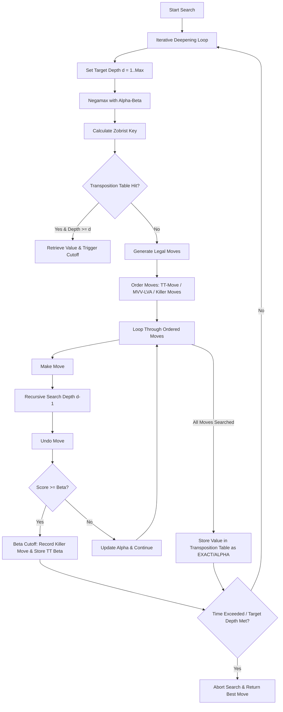

#  Kronos Chess & Empirical Research Laboratory

[](https://react.dev)
[](https://vite.dev)
[](https://github.com/jhlywa/chess.js)
[](https://github.com/niklasf/stockfish.js)
[](https://nodejs.org)
[](https://github.com/piyush2180/kronos)

**Kronos Chess** is a desktop-first chess web application and empirical research laboratory. It bridges the gap between clean web applications and computational chess systems, providing both a player workspace and an automated engine research framework.

---

## 📖 Table of Contents

* [System Architecture Overview](#system-architecture-overview)
* [Key Platform Features](#key-platform-features)
* [Custom Chess Engine Architecture](#custom-chess-engine-architecture)
* [Empirical Research & Benchmarking Framework](#empirical-research--benchmarking-framework)
* [Research Laboratory UI Workstation](#research-laboratory-ui-workstation)
* [Automated Research Pipeline Manager](#automated-research-pipeline-manager)
* [CLI Command Reference](#cli-command-reference)
* [Repository Folder Structure](#repository-folder-structure)
* [Installation & Local Setup](#installation--local-setup)

---

## 🏗️ System Architecture Overview

Kronos is built as a complete, three-pillar ecosystem:

```
┌─────────────────────────────────────────────────────────────────────────┐
│                           KRONOS ECOSYSTEM                              │
├───────────────────────────┬─────────────────────────┬───────────────────┤
│    1. CHESS PLATFORM      │   2. CUSTOM ENGINE      │ 3. RESEARCH LAB   │
│  • Play vs AI             │  • Minimax / Negamax    │ • Pipeline Mgr    │
│  • Analysis Board         │  • Alpha-Beta Pruning   │ • SPRT Analytics  │
│  • Tactical Puzzles       │  • Iterative Deepening  │ • Stockfish Calib │
│  • Position Editor        │  • Move Ordering        │ • Ablation Suite  │
│  • Opening Explorer       │  • Zobrist & TT         │ • Experiment Comp │
│  • Custom Board Themes    │  • Quiescence Search    │ • Reproducibility │
└───────────────────────────┴─────────────────────────┴───────────────────┘
```

---

## ⚙️ Custom Chess Engine Architecture

The **Kronos Engine** is a custom chess solver implemented in JavaScript and executed on dedicated background Web Worker threads.

### Search Flow & Execution Graph



### Core Search Optimizations

* **Negamax Formulation**: Evaluates search trees from the perspective of the active player.
* **Alpha-Beta Pruning**: Efficiently eliminates unpromising subtree branches.
* **Iterative Deepening**: Progressively increases search depth (Depths 1..N), ensuring instant move retrieval upon timeout.
* **Move Ordering (MVV-LVA & Killer Moves)**: Prioritizes Transposition Table best moves, followed by Most Valuable Victim – Least Valuable Aggressor captures and Killer Moves.
* **Zobrist Hashing**: Maps board positions to 64-bit keys using precomputed pseudo-random arrays.
* **Transposition Tables (TT)**: Caches evaluated positions to prevent redundant processing.
* **Quiescence Search**: Resolves the horizon effect by extending search lines through tactical capture sequences.

---

## 🔬 Empirical Research & Benchmarking Framework

Kronos includes a headless Node.js benchmarking framework capable of generating publishable experimental data.

### Research Design Principles
* **Data Integrity**: Every displayed value originates from actual engine execution (no simulated or hardcoded Elo ratings).
* **Reproducibility Metadata**: Every experiment package logs `Experiment ID`, `Timestamp`, `Git Commit Hash`, `Config Checksum`, `Random Seed`, `Engine Revision`, `Depth`, `Games`, `Opening Suite Hash`, `Machine Specs`, and `Node Version`.
* **Multi-Family Experiment Architectures**:
  * **Family A (Cumulative Evolution)**: Tests incremental engine strength progression (`Baseline` → `AlphaBeta` → `MoveOrdering` → `Killer` → `TranspositionTable` → `Quiescence` → `Full Kronos`).
  * **Family B (Ablation Isolation)**: Measures feature importance by testing `Full Kronos` against modified engine configs with individual search features disabled (`No AlphaBeta`, `No TT`, `No Quiescence`, `No Killer`, `No MoveOrdering`).
  * **Family C (Opening Robustness Suite)**: Validates optimization consistency across distinct opening structures (Italian Game, Sicilian Defense, French Defense, Queen's Gambit, and Random FENs).

---

## 📊 Research Laboratory UI Workstation

The web interface includes an engineering workstation (`ResearchLabPage.jsx`) for visualizing and inspecting experiments:

* **Research Dashboard**: Displays a thin engineering status bar and live telemetry metrics stream (CPU utilization, NPS, total nodes evaluated, active game count, and current opening line).
* **Stockfish Calibration Pipeline**: Maps engine difficulty levels against Stockfish fixed-depth benchmarks (Depths 1–5), computing win/draw/loss rates and 95% confidence intervals. Displays "Calibration Pending" for unverified levels.
* **Search Optimization Timeline**: Matches engine versions against telemetry logs to chart performance gains across search evolution stages.
* **Search Validation & Tactical Solution Suite**: Evaluates static tactical and positional puzzles, tracking move solution accuracy and solution latencies.
* **Research Archive Index**: Manages JSON and PGN experiment summaries with single-click import and export tools.
* **Side-by-Side Experiment Delta Comparator**: Interactive comparison tool allowing researchers to select any two experiments (`EXP001` vs `EXP002`) and inspect side-by-side metric tables (Tournament Games, Score %, Elo Diff, NPS Throughput, Branching Factor, and Nodes Searched).

---

## 🤖 Automated Research Pipeline Manager

The Research Pipeline Manager (`benchmark/pipelineManager.js`) provides automated experiment orchestration for overnight research runs with zero manual intervention.

### Automated Execution Sequence (`npm run research`)

```
npm run research
       │
       ▼
1. Benchmark Suite (Family A & Family B)
       │
       ▼
2. Stockfish Calibration Pipeline Matrix
       │
       ▼
3. Position Validation Suite
       │
       ▼
4. Dataset Integrity & Metadata Verification
       │
       ▼
5. Statistical Analysis & SPRT Computation
       │
       ▼
6. Telemetry SVG Chart Generation
       │
       ▼
7. Dynamic Index Registration (index.json)
       │
       ▼
8. Research Archive & Manifest Export (experiment_manifest.json & summary.md)
       │
       ▼
"Research Pipeline Completed Successfully"
```

### Pipeline Resilience & Failure Recovery
* **Persistent Queue Tracking (`queue_state.json`)**: Tracks execution states (`QUEUED`, `RUNNING`, `COMPLETED`, `FAILED`).
* **Crash Recovery**: If the system is interrupted, re-launching `npm run research` automatically reads `queue_state.json` and resumes from the last unfinished experiment without repeating completed matches.
* **Dynamic Indexing (`index.json`)**: Completed experiments automatically register into `benchmark/output/index.json`. The web UI dynamically loads this index via `BenchmarkDataService` without requiring code compilation or bundling.

---

## 💻 CLI Command Reference

| Command | Purpose |
| :--- | :--- |
| `npm run dev` | Launch interactive development server (`http://localhost:5174`) |
| `npm run build` | Compile production web application assets |
| `npm run research` | Execute automated 9-stage research pipeline suite |
| `npm run research -- --robustness` | Execute research pipeline with optional opening robustness suite |
| `npm run benchmark:suite` | Run multi-family tournament benchmark suite |
| `npm run benchmark:calibrate` | Run Stockfish fixed-depth calibration matrix |
| `npm run benchmark:positions` | Run tactical position benchmark suite |

---

## 📂 Repository Folder Structure

```text
kronos-chess/
├── benchmark/                  # Node.js Headless Benchmarking & Research Suite
│   ├── configs/                # Engine tournament & ablation configuration JSONs
│   ├── openings/               # Standard openings and tactical FEN test sets
│   ├── output/                 # Archived experiment packages, index.json, & reports
│   ├── engineFactory.js        # Engine instantiation & worker pool factory
│   ├── graphGenerator.js       # SVG telemetry chart generation utilities
│   ├── integrityValidator.js   # Reproducibility metadata & verification rules
│   ├── pipelineManager.js      # Automated Research Pipeline Manager (npm run research)
│   ├── positionBenchmark.js    # Tactical puzzle suite evaluator
│   ├── reportGenerator.js      # Markdown & JSON experiment package generator
│   └── tournament.js           # Engine vs Engine tournament runner with SPRT
├── src/                        # Core Application Code
│   ├── components/             # UI Components
│   │   └── research/           # Research Laboratory Workstation Components
│   │       ├── DashboardView.jsx        # Telemetry monitor & engineering status bar
│   │       ├── EngineCalibration.jsx    # Stockfish calibration pipeline view
│   │       ├── ExperimentComparison.jsx # Side-by-side experiment delta comparator
│   │       ├── OptimizationTimeline.jsx # Algorithm evolution stage tracker
│   │       ├── ResearchArchive.jsx      # Experiment package archive & JSON import/export
│   │       └── SearchValidationSuite.jsx# Tactical solution verification suite
│   ├── engine/                 # Custom Minimax Search Engine (Web Worker)
│   ├── services/               # Data Services (BenchmarkDataService.js)
│   ├── hooks/                  # Game state hooks (useChessGame.js)
│   └── pages/                  # Main Workstation Pages (ResearchLabPage.jsx, etc.)
├── package.json                # Scripts & project dependencies
└── README.md                   # Repository documentation
```

---

## 🚀 Installation & Local Setup

### 1. Prerequisites
Ensure **Node.js** (v18 or higher) is installed on your machine.

### 2. Clone Repository & Install Dependencies
```bash
git clone https://github.com/piyush2180/kronos.git
cd kronos
npm install
```

### 3. Start Development Application
```bash
npm run dev
```

### 4. Launch Automated Research Suite
```bash
npm run research
```

---

## 📜 License & Acknowledgements

* **Libraries**: Powered by [React](https://react.dev), [Vite](https://vite.dev), [Chess.js](https://github.com/jhlywa/chess.js), [react-chessboard](https://github.com/Cllement/react-chessboard), and [Stockfish.js](https://github.com/niklasf/stockfish.js).
* **Disclaimer**: *Kronos Chess is an independent educational and empirical research project.*
