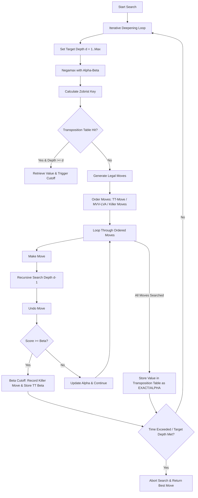

#  Kronos Chess

[](https://react.dev)
[](https://vite.dev)
[](https://github.com/jhlywa/chess.js)
[](https://github.com/niklasf/stockfish.js)
[](https://opensource.org/licenses/MIT)
[](https://github.com/piyush2180/kronos)

Kronos Chess is a desktop-first, feature-rich modern chess platform. It bridges the gap between clean, responsive web design and advanced computational chess systems. Driven by a custom chess engine running concurrently on background threads, Kronos offers high-tier visual evaluation, real-time puzzle training, custom position editing, and integrated Stockfish diagnostics.

---

## 📖 Table of Contents

* [About](#about)
* [Key Features](#features)
* [Visual Showcase](#screenshots)
* [Custom Chess Engine](#chess-engine)
* [System Architecture](#architecture)
* [Technology Stack](#technology-stack)
* [Performance Optimizations](#performance-optimizations)
* [Folder Structure](#folder-structure)
* [Installation & Startup](#installation)
* [Usage Guide](#usage)
* [Future Roadmap](#future-roadmap)
* [Acknowledgements & Disclaimer](#acknowledgements)

---

## 🌟 About

Kronos Chess is designed for players who appreciate chess aesthetics as much as tactical depth. Traditional web-based chess platforms are often visually dated or run computation synchronously, causing UI stutters. Kronos solves this by isolating all heavy engine searches (both our custom Minimax engine and Stockfish analysis) in asynchronous Web Workers. 

The application offers an immersive chess workstation experience featuring:
* A **custom engine** featuring advanced search optimizations.
* **Deep telemetry** including real-time Heatmaps and evaluation curves.
* **Dynamic Training views** that update interactively as you play.

---

## 🎨 Visual Showcase

> [!NOTE]
> Screenshots are loaded from the local `./src/assets/` folder. Replace these with production captures after compiling your build.

### Dashboard

*A sleek hub containing game modes, live puzzle tracking, and navigational shortcuts.*

### Play vs Engine
``
*Face off against the Kronos engine with adjustable difficulty, responsive move feedback, and clean audio signals.*

### Analysis Board
``
*Explore variants with a real-time evaluation bar, Stockfish suggestions, best move lines, and board heatmaps.*

### Puzzle Trainer
``
*Train tactics using a curated library of puzzles divided into granular rating brackets.*

### Position Editor
``
*Drag-and-drop setup for arbitrary positions with complete castling, en-passant, and turn configurations.*

### Opening Explorer
``
*Study theoretical variations with live line names and interactive preview boards.*

---

## ⚙️ Custom Chess Engine

At the heart of this project is the **Kronos Engine**, a custom chess solver written from scratch in JavaScript and run in a Web Worker.

### Search Flow & Optimizations



### 🔬 Core Components

*   **Negamax formulation**: Implements Minimax search using a single, unified codebase to evaluate positions from the active player's viewpoint.
*   **Alpha-Beta Pruning**: Prunes unpromising branches of the search tree once a move is found that guarantees a better score than a previously evaluated line.
*   **Iterative Deepening**: Progressively searches to increasing depths (1, 2, 3, etc.). This ensures that if the search time limit is exceeded, Kronos can instantly fall back to the best move calculated in the last fully completed iteration.
*   **Move Ordering (MVV-LVA & Killer Moves)**: Drastically improves alpha-beta efficiency by sorting moves. Prioritizes the best move from the Transposition Table, followed by Captures (sorted using Most Valuable Victim - Least Valuable Aggressor), Promotions, and **Killer Moves** (non-capture moves that caused beta cutoffs in sister nodes).
*   **Zobrist Hashing**: Maps the current board state (pieces, turn, castling rights, en-passant file) to a unique 64-bit key via pre-generated random bitstrings.
*   **Transposition Tables (TT)**: Caches search results for encountered board positions, preventing redundant deep evaluations when transposition cycles occur.
*   **Quiescence Search**: Solves the "horizon effect" by extending the search beyond the depth limit for capture sequences until the position becomes stable.
*   **Tapered Evaluation**: Automatically calculates the game phase (Middlegame vs. Endgame) to interpolate positional piece-square weights (PST). Evaluates:
    *   **Material Values**: $P=100$, $N=320$, $B=330$, $R=500$, $Q=900$, $K=20000$.
    *   **Pawn Structure**: Doubled pawns and isolated pawns are calculated and penalized.
    *   **King Safety**: Encourages a hidden, protected king in the middlegame, while driving an active, central king in endgames.

---

## 🏗️ System Architecture

Kronos separates game state, UI rendering, move validation, and core engine processing to ensure stutter-free operations:

```mermaid
graph TD
    User([User Interactive Interface]) <--> React[React UI Components]
    React <--> Controller[Game Controller: useChessGame Hook]
    Controller <--> ChessJS[Chess.js: Rule Validation & Move Gen]
    Controller <--> Storage[(Local Storage: History & Preferences)]
    
    subgraph Web Worker Threads (Parallel)
        Controller <--> Kronos[Kronos Engine Worker: Minimax/Search]
        Controller <--> Stockfish[Stockfish.js Worker: Deep Evaluation]
    end
```

### Module Descriptions
*   **React UI**: Manages render trees, themes, audio, and visual feedback (such as Heatmaps).
*   **useChessGame**: The central engine orchestrator. Manages game configurations, time controls, and marshals messages to Web Workers.
*   **Chess.js**: Acts as the official rule arbiter, validating moves, checking game termination states, and providing FEN outputs.
*   **Web Workers**: Run the Kronos Search and Stockfish.js instances concurrently on browser background threads.

---

## 🛠️ Technology Stack

| Layer | Technology | Purpose |
| :--- | :--- | :--- |
| **Frontend UI** | React 19.2 + Vite 8.1 | High-performance rendering & hot-module reloading |
| **Style System** | CSS Custom Properties | Theme variables (Neon, Emerald, Blue, Dark), responsive grids |
| **Rule Validation** | `chess.js` 1.4 | Official rule compliance and parsing |
| **Chessboard UI** | `react-chessboard` 5.10 | Fluid, drag-and-drop board interface |
| **Background Solver** | Custom Negamax Engine | Multithreaded custom AI running inside a Web Worker |
| **Stockfish Telemetry** | `stockfish.js` 10.0 (Web Worker) | Real-time evaluation bar and best-move highlights |
| **Icons & Style** | `lucide-react` | Crisp, scalable dashboard and action iconography |
| **Linter / Quality** | `oxlint` 1.69 | Fast, modern code analysis and verification |

---

## 🚀 Performance Optimizations

*   **Asynchronous Web Workers**: By instantiating both the Kronos engine and Stockfish.js as background workers, the main JavaScript thread remains completely free for UI updates and board drag-and-drop actions.
*   **Transposition Table Cache**: Avoids re-searching identical positions, saving up to 60% of search nodes in complex middle-games.
*   **Tapered King Evaluations**: Prevents search oscillations by smoothly adjusting positional parameters as material leaves the board.
*   **Lazy Loading Views**: App pages (About, Analysis, Play, Local) are loaded dynamically to decrease initial bundle weight.
*   **Board Highlight Isolation**: Move highlighting and heatmap overlays bypass complete board re-renders for speed.

---

## 📂 Folder Structure

```text
kronos-chess/
├── public/                     # Public static files
│   ├── favicon.svg             # Application logo
│   ├── icons.svg               # SVG sprites for custom pieces
│   └── puzzles/                # Puzzles sorted into JSON rating bands
├── scripts/                    # Development automation and data validation
│   ├── download_puzzles.py     # Script to pull and filter puzzles
│   └── validate_puzzles.js     # Validates puzzles against chess.js rules
├── src/                        # Core application code
│   ├── assets/                 # SVGs and banner artwork
│   ├── components/             # Reusable modular UI components
│   │   ├── ChessBoard.jsx      # Chessboard layout, heatmaps, & highlights
│   │   ├── EvaluationBar.jsx   # Visual score gauge powered by Stockfish
│   │   ├── MoveHistory.jsx     # Log of current game moves
│   │   ├── OpeningExplorer.jsx # Theoretical opening panels
│   │   └── ...                 # Command palette, puzzles, editor, profile
│   ├── engine/                 # Custom search engine
│   │   ├── minimax.js          # Negamax search & alpha-beta pruning
│   │   ├── evaluation.js       # Positional & phase evaluation
│   │   ├── transposition.js    # Cache storage and hash-hits
│   │   ├── zobrist.js          # 64-bit zobrist key generation
│   │   └── worker.js           # Entrypoint for the web worker thread
│   ├── hooks/                  # Custom react hooks
│   │   └── useChessGame.js     # Core gameplay state and worker interface
│   ├── pages/                  # Top-level page views
│   │   ├── Dashboard.jsx       # Landing panel and hub
│   │   ├── LocalPage.jsx       # Local Pass & Play workspace
│   │   ├── PlayPage.jsx        # Play vs Engine workspace
│   │   └── AnalysisPage.jsx    # Stockfish Analysis workspace
│   ├── utils/                  # Utility helper files
│   ├── App.jsx                 # Routing and navigation structure
│   ├── index.css               # CSS variables and styling tokens
│   └── main.jsx                # Application root mount point
├── package.json                # Project configurations & dependency versions
└── README.md                   # Project documentation
```

---

## 💻 Installation

Follow these steps to compile and run Kronos Chess locally:

### 1. Prerequisites
Ensure you have **Node.js** (v18 or higher) installed on your system.

### 2. Clone the Repository
```bash
git clone https://github.com/piyush2180/kronos.git
cd kronos
```

### 3. Install Dependencies
```bash
npm install
```

### 4. Launch Development Server
```bash
npm run dev
```
Open your browser and navigate to `http://localhost:5174` (or the port specified in your terminal).

### 5. Compile for Production
```bash
npm run build
```

---

## 🕹️ Usage Guide

### 🤖 Play vs Engine
Choose between multiple difficulty levels. This adjusts the target search depth and time limits of the custom Kronos engine. You can play as White or Black, configure time controls, and track your active performance.

### 🔍 Analysis Board
Import positions using **FEN** strings or games using **PGN** files. Toggle the **Evaluation Bar** to see Stockfish's real-time assessment, use the **Heatmap** to see active squares, and review candidate moves.

### 🧩 Puzzle Trainer
Select a rating band (e.g. 1000-1200) and solve tactical challenges. If you get stuck, use the *Show Solution* button to study the winning line.

### 🛠️ Position Editor
Clear the board or start from the initial setup. Add or remove pieces, set active player turns, and copy the resulting FEN string to instantly import it into the Analysis Board.

---

## 🗺️ Future Roadmap

*   [ ] **Real-time Multiplayer**: WebSockets-driven online matchmaking and lobbies.
*   [ ] **Comprehensive Game Reviews**: Auto-generate graphs highlighting blunders, mistakes, and brilliant moves directly.
*   [ ] **Engine Benchmarking Suite**: In-browser metrics showing search speed (Knps - kilo-nodes per second) and memory usage.
*   [ ] **Interactive Lessons**: Expand the learn section to support custom FEN-based exercise boards.

---

## 📜 Acknowledgements & Disclaimer

*   **Inspirations**: The clean aesthetics and analysis interfaces are inspired by [Lichess](https://lichess.org).
*   **Libraries**: We rely heavily on [Chess.js](https://github.com/jhlywa/chess.js) for move generation and [Stockfish.js](https://github.com/niklasf/stockfish.js) for analysis.
*   **Disclaimer**: *Kronos Chess is an independent educational project and is not affiliated with, endorsed by, or associated with Lichess, Chess.com, or the official Stockfish team.*
